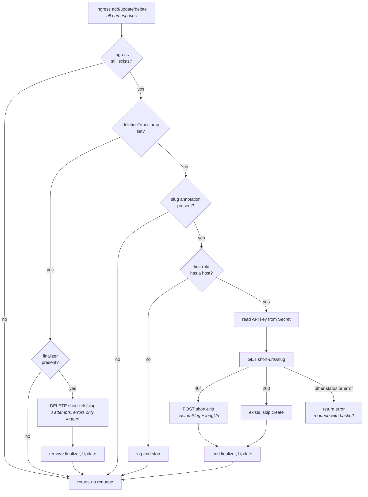

# shlink-ingress-controller

> A Kubernetes controller that creates and deletes [Shlink](https://shlink.io) short URLs for
> annotated Ingress resources.

[](https://github.com/vollminlab/shlink-ingress-controller/actions/workflows/ci.yml)
[](https://github.com/vollminlab/shlink-ingress-controller/actions/workflows/build.yml)


Adding a service to the cluster used to mean adding an Ingress *and* remembering to hand-create a
short link for it. This controller removes the second step: put a
`shlink.vollminlab.com/slug` annotation on the Ingress and the short URL is created from
`spec.rules[0].host`, then torn down when the Ingress is deleted.

The design decision worth knowing up front is that reconciliation is **create-only**. The
controller checks whether the slug exists and creates it if it does not — it never rewrites an
existing short URL. Deletion is the mirror image: cleanup runs on a best-effort basis and is
explicitly allowed to fail, because a Shlink outage must never leave an Ingress stuck in
`Terminating`.

---

## Architecture

Built on `sigs.k8s.io/controller-runtime`. A single manager watches `networking.k8s.io/v1`
Ingresses cluster-wide; there is no CRD and no webhook. State lives entirely in two places: the
finalizer on the Ingress, and the short URL in Shlink.



### What the loop does and does not do

| Event | Behaviour |
|---|---|
| Ingress created with the annotation | `GET` the slug; `POST` it if absent; add the finalizer |
| Ingress already has the slug in Shlink | Logs `short URL already exists, skipping`; adds the finalizer anyway |
| Ingress host changed | **Nothing.** The slug already exists, so the short URL keeps pointing at the old host |
| Annotation removed from a live Ingress | **Nothing.** The short URL and the finalizer both remain |
| Ingress deleted | `DELETE` the slug up to 3 times, then remove the finalizer regardless of the outcome |
| Ingress without the annotation | Returns immediately; no finalizer is ever added |
| Ingress with no `spec.rules` or an empty host | Logs `ingress has no host, skipping` and returns |

The finalizer string is exactly `shlink.vollminlab.com/finalizer`.

Two consequences of the table above are worth calling out, because they are easy to get wrong:

- **Renaming a host does not migrate the short URL.** Delete the Ingress and recreate it, or change
  the slug, if the destination needs to move.
- **Removing the annotation is not a delete.** The slug comes from the *live* annotation at
  deletion time, so an Ingress whose annotation was stripped first will attempt
  `DELETE /short-urls/` with an empty slug, fail three times, log the error, and drop the finalizer.
  The Ingress still deletes cleanly; the short URL is simply orphaned.

## Annotation

| Annotation | Required | Description |
|---|---|---|
| `shlink.vollminlab.com/slug` | yes | Desired short URL slug, e.g. `my-app` |

There are no optional annotations. The long URL is always `https://` + `spec.rules[0].host` — only
the first rule is read, and the scheme is hardcoded.

```yaml
apiVersion: networking.k8s.io/v1
kind: Ingress
metadata:
  name: my-app
  annotations:
    shlink.vollminlab.com/slug: my-app
spec:
  rules:
    - host: my-app.vollminlab.com
      ...
```

This creates `https://go.vollminlab.com/my-app` → `https://my-app.vollminlab.com`.

The actual short links — e.g. `https://vollm.in/my-app` — also resolve to the same destination.
Shlink is configured with `vollm.in` as an additional domain, so both `go.vollminlab.com/<slug>`
and `vollm.in/<slug>` work. The controller only needs to call the API once; Shlink handles both
domains automatically.

## Shlink API usage

Every request carries the API key in an `X-Api-Key` header. The HTTP client has a fixed 10 second
timeout. Paths are appended to the configured base URL, which defaults to the v3 REST prefix.

| Call | Method + path | Accepted responses | Anything else |
|---|---|---|---|
| Look up a slug | `GET {base}/short-urls/{slug}` | `200` → exists, `404` → does not exist | error |
| Create a slug | `POST {base}/short-urls` | `200`, `201`, and `409` → treated as success | error |
| Delete a slug | `DELETE {base}/short-urls/{slug}` | `200`, `204` | error |

The create body is `{"longUrl": "...", "customSlug": "..."}`. `409 Conflict` is deliberately
swallowed: the slug already existing is the desired end state, so a race between two reconciles
is not an error.

## Failure behaviour

| Failure | Result |
|---|---|
| Shlink unreachable or 5xx during `GET`/`POST` | `Reconcile` returns the error; controller-runtime requeues with exponential backoff, from 5 ms up to a 1000 s ceiling, under a global 10 qps / 100 burst limiter |
| API key Secret missing, unreadable, or `initial-api-key` empty | Same — the reconcile errors and is requeued, so the Ingress gets no finalizer until the Secret is fixed |
| Shlink unreachable during Ingress deletion | Three immediate `DELETE` attempts with no delay between them, then the error is logged and the finalizer is removed anyway |

The asymmetry is intentional and is the single most important design point in the controller:
creation retries forever, deletion never blocks. `deleteWithRetry` always returns `nil` so that a
Shlink outage cannot wedge `kubectl delete ingress`. The trade-off is that a short URL can be
orphaned in Shlink; nothing reconciles that afterwards.

## Configuration

All configuration is via command-line flags. The controller reads **no environment variables**.

| Flag | Default | Description |
|---|---|---|
| `--shlink-api-url` | `https://go.vollminlab.com/rest/v3` | Shlink REST API base URL |
| `--shlink-secret-name` | `shlink-credentials` | Secret holding the API key |
| `--shlink-secret-namespace` | `shlink` | Namespace of that Secret |
| `--metrics-bind-address` | `:8080` | Address for the controller-runtime metrics endpoint |

`zap.Options.BindFlags` is also wired in, so the standard controller-runtime logging flags are
accepted: `--zap-devel`, `--zap-encoder`, `--zap-log-level`, `--zap-stacktrace-level`,
`--zap-time-encoding`. Development mode is off by default, so logs are JSON.

The manager's cache is scoped so that **Secrets are only cached in `--shlink-secret-namespace`**.
Ingresses are cached cluster-wide. This is why the Secret RBAC below is a namespaced Role rather
than part of the ClusterRole — and why it needs `list` and `watch` and not just `get`: a cached
client establishes an informer, which cannot run on `get` alone.

### API key Secret

The controller reads its API key from the `initial-api-key` key of the configured Secret, on every
reconcile via the cache — so rotating the value in the Secret is picked up without a restart.

```yaml
apiVersion: v1
kind: Secret
metadata:
  name: shlink-credentials
  namespace: shlink
type: Opaque
stringData:
  initial-api-key: <your-shlink-api-key>
```

In the cluster this Secret is materialized from 1Password by External Secrets Operator; it is never
committed. Create the API key in the Shlink admin UI or via the Shlink CLI before deploying.

## Deployment

The image and the Helm chart are both published to Harbor, the internal container registry running
in the Kubernetes cluster at `harbor.vollminlab.com` — see `k8s-vollminlab-cluster` for its
deployment.

```sh
helm registry login harbor.vollminlab.com

helm install shlink-ingress-controller \
  oci://harbor.vollminlab.com/vollminlab/charts/shlink-ingress-controller \
  --namespace shlink \
  --create-namespace
```

Releases are cut by pushing a `v*` tag. The **Build and Push** workflow then builds the image and
tags it both `v<semver>` and `<semver>`, and packages the chart with `--version`/`--app-version`
set from the tag. `Chart.yaml` therefore carries a placeholder `version: 0.1.0` that is never
published — the real chart version is the git tag, most recently `v0.3.6`.

### Chart values

| Value | Default | Description |
|---|---|---|
| `image.repository` | `harbor.vollminlab.com/vollminlab/shlink-ingress-controller` | Controller image |
| `image.tag` | `""` → falls back to `.Chart.AppVersion` | Image tag |
| `image.pullPolicy` | `IfNotPresent` | Image pull policy |
| `imagePullSecrets` | `[]` | Pull secrets for a private registry |
| `shlink.apiUrl` | `https://go.vollminlab.com/rest/v3` | Passed as `--shlink-api-url` |
| `shlink.secretName` | `shlink-credentials` | Passed as `--shlink-secret-name` |
| `shlink.secretNamespace` | `shlink` | Passed as `--shlink-secret-namespace`; also the namespace of the Role and RoleBinding |
| `resources` | `{}` | Container resources |
| `nameOverride` | `""` | Overrides the chart name in resource names and labels |
| `fullnameOverride` | `""` | Overrides the full resource name |

Two chart limits to be aware of:

- **`resources` defaults to `{}`.** Any cluster with an admission policy requiring CPU and memory
  requests and limits — this one does, via Kyverno — will reject the Deployment unless a value is
  supplied.
- **The Deployment declares no container port and the chart ships no Service.** The metrics
  endpoint listens on `:8080` inside the pod but is not scrapable as shipped.

`replicas` is hardcoded to 1 and is not exposed as a value. There is no leader election, so do not
raise it by patching the Deployment.

### RBAC

| Kind | Namespace | API group | Resources | Verbs |
|---|---|---|---|---|
| ClusterRole | cluster-wide | `networking.k8s.io` | `ingresses` | `get`, `list`, `watch`, `update` |
| Role | `shlink.secretNamespace` | `""` | `secrets` | `get`, `list`, `watch` |

`update` on Ingresses exists solely to add and remove the finalizer — the controller never modifies
any other field of an Ingress.

## Tests

Unit tests use a fake client and a stub Shlink client. Integration tests run the real manager
against `envtest` and are behind the `integration` build tag, so `go test ./...` alone does not run
them. Both suites run in CI on every PR.

```sh
go test ./...

# integration — needs envtest binaries
export KUBEBUILDER_ASSETS=$(setup-envtest use 1.32 --bin-dir /tmp/envtest-bins -p path)
go test -tags integration -timeout 120s ./internal/controller/
```

The integration suite injects a mock through `IngressReconciler.ShlinkClientOverride`, which is
`nil` in production. It asserts on the finalizer appearing, because that is the observable proof
that a reconcile completed.

## License

Apache License 2.0 — see [LICENSE](LICENSE).
